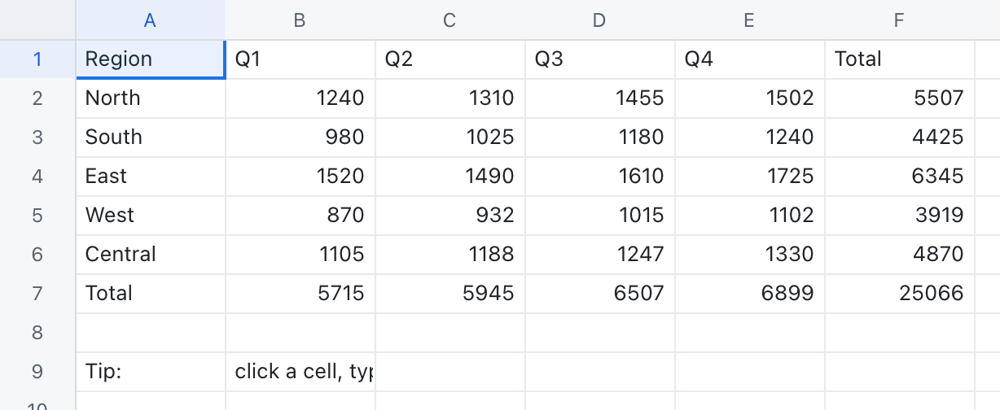

# lattice

**A spreadsheet, rebuilt from first principles in Rust — a fast, sparse calc engine with Excel-accurate formulas and dependency-ordered recalculation, wrapped in a desktop grid.**

**By Daniel Bracher · [@danieldevelopes-collab](https://github.com/danieldevelopes-collab)** · MIT · Rust + Tauri



---

## What it is

**lattice** is a spreadsheet system. You type numbers, text, and formulas into a
grid of cells; the cells reference one another; and when one value changes,
everything that depended on it updates — automatically, and in the right order.
That single behaviour — *automatic recalculation* — is what makes a spreadsheet a
spreadsheet rather than a fancy table, and getting it right is most of the work.

I built lattice to understand that machinery by writing every piece of it myself:
the cell model, the A1 addressing scheme, a real formula language with a lexer and
a parser and an evaluator, the dependency graph that drives recalculation, a
library of around sixty functions, and the file formats that let a workbook
survive being closed. The calculation engine is pure Rust and knows nothing about
windows or pixels, so it can be — and is — tested entirely on its own. On top of
it sits a Tauri desktop app with a virtualized canvas grid that feels like the
spreadsheets you already know.

### Features

- **A sparse cell / sheet / workbook model.** Only the cells you actually use cost
  anything; a workbook holds many sheets, each an independent grid.
- **A1 addressing done properly.** Bijective base‑26 column names
  (`A`, `Z`, `AA`, `AB`, … `ZZ`, `AAA`), `$` absolute markers (`$A$1`, `A$1`,
  `$A1`), and ranges (`B2:C3`) that normalise and iterate.
- **A genuine formula language.** A lexer feeds a precedence‑climbing parser that
  builds an expression tree, which an evaluator walks. Arithmetic, comparisons,
  string concatenation with `&`, percent literals, and unary minus all behave the
  way a working spreadsheet user expects.
- **Excel‑accurate evaluation,** down to the famous quirk that `-2^2` is **4**
  (unary minus binds tighter than the caret) and `2^3^2` is **64**
  (`^` is left‑associative). Errors — `#DIV/0!`, `#VALUE!`, `#NAME?`, `#N/A`,
  `#NUM!`, `#NULL!`, `#REF!` — propagate exactly as they should, and `IF` /
  `IFERROR` are lazy, so an untaken `1/0` branch never runs.
- **Dependency-ordered recalculation** built on a dependency graph: extract each
  formula's precedents, topologically sort (Kahn's algorithm), and recompute in
  order so every cell reads fresh inputs — with circular‑reference detection.
- **Around sixty functions** across maths, statistics, text, logical, lookup, and
  information families — `SUM`, `AVERAGE`, `IF`, `VLOOKUP`, `HLOOKUP`,
  `INDEX`/`MATCH`, `SUMIF`, `COUNTIF`, `SUMPRODUCT`, `ROUND`, `MOD`, `LEFT`,
  `MID`, `SUBSTITUTE`, `TEXTJOIN`, `AND`/`OR`/`NOT`, `ISNUMBER`, and more.
- **A number-format engine and a cell-style system,** both implemented and
  unit-tested in the engine: Excel-style format codes (number, currency, percent,
  scientific, date/time) and interned cell styles — ready to be wired to the grid.
- **File interop** for CSV, real Excel **`.xlsx`**, OpenDocument **`.ods`**, and a
  native JSON format.
- **A desktop app** with a virtualized grid, a formula bar, row/column headers,
  and selection and in‑place editing.

---

## How it's built

lattice is three layers, and the boundaries between them are deliberate.

### 1. `sheet-core` — the engine (pure Rust, no UI)

This is the part I care most about. It is a plain Rust library with no knowledge
of any front end, which is exactly why it can be exercised exhaustively in
isolation. It contains:

- **the model** — sparse `Cell` / `Sheet` / `Workbook` types;
- **A1 addressing** — `CellRef`, `Range`, and the bijective base‑26 conversions,
  with `$` absolute markers;
- **the value system** — numbers, text, booleans, blanks, and the Excel error set,
  plus the coercion rules that decide when `"5"` counts as a number and when a
  stray string in a range is quietly ignored by `SUM`;
- **the formula pipeline** — `lexer` → `parser` (precedence climbing) → `ast` →
  `eval`;
- **the function library** — see `functions.rs`, where lazy functions and
  geometry‑aware lookups read their *raw* argument expressions while everything
  else takes already‑evaluated arguments; and
- **`recalc`** — the dependency graph and ordered recompute described below.

Because none of this depends on a UI, the engine ships with a thorough test suite
that runs headlessly: column‑letter round trips, A1 parsing and rejection of
junk, operator precedence including the `-2^2 = 4` case, lazy `IF`, range
aggregation, error propagation, and full workbook recalculation.

### 2. `sheet-io` — persistence and interop

Reading and writing workbooks: **CSV** (via `csv`), real Excel **`.xlsx`**
(reading with `calamine`, writing genuine spreadsheet files with
`rust_xlsxwriter`), OpenDocument **`.ods`**, and a **native JSON** format (via
`serde` / `serde_json`). These produce real files that your operating system and
other spreadsheet applications open without complaint.

### 3. `src-tauri` + `src` — the desktop app

A [Tauri](https://tauri.app) application. The Rust side hosts the engine; the
front end draws a **virtualized canvas grid** — only the visible cells are
rendered, so scrolling a large sheet stays smooth — with a formula bar, column and
row headers, and selection and editing that behave like Excel or Google Sheets.

### The heart of it: dependency‑graph recalculation

Every spreadsheet lives or dies on this, so it is worth saying plainly how
lattice does it.

The formula cells on a sheet form a directed graph. An edge **p → c** means cell
`c` reads cell `p`, so `p` must be computed first. When something changes, the
engine marks the affected cells dirty, extracts each formula's precedents, and
orders the cells with a **topological sort** (Kahn's algorithm). It then evaluates
them in that order, writing each result back before any of its dependents are
visited — so every cell always reads freshly computed inputs. Cells that form a
cycle cannot be ordered; those
are detected and flagged **`#REF!`** as a circular reference rather than being
allowed to spin forever. Sheet‑qualified references such as `Sheet2!A1` are
treated as external inputs — read during evaluation, but not turned into ordering
edges within a single sheet's recompute.

That is the whole trick, and it is the difference between a spreadsheet and a
calculator.

---

## A short history of the spreadsheet

It helps to know what lattice is descended from.

**VisiCalc (1979).** The first electronic spreadsheet, written by **Dan Bricklin**
and **Bob Frankston** for the Apple II. Bricklin, then a Harvard MBA student,
imagined a "magic blackboard" that recalculated automatically; Frankston wrote the
implementation. VisiCalc *invented automatic recalculation* and became the
original **"killer app"** — software so useful that people bought the computer in
order to run it. It is widely credited with selling the Apple II to businesses and
turning the personal computer into a serious tool.

**Lotus 1‑2‑3 (1983).** Created at Lotus Development by **Mitch Kapor**, 1‑2‑3
combined the spreadsheet with charting and rudimentary database features, was
tuned hard for the IBM PC, and quickly overtook VisiCalc to become the defining
business application of the 1980s.

**Microsoft Excel (1985).** Microsoft shipped the first version of Excel for the
Apple Macintosh in 1985, bringing a graphical interface and the mouse to the
spreadsheet before the Windows version followed. Over the decades that followed,
Excel became the spreadsheet against which all others are measured — and the one
whose behaviour, quirks and all, lattice works hard to match.

**Google Sheets (2006).** Google's browser‑based, collaborative spreadsheet
(growing out of an acquisition and launched in 2006) moved the spreadsheet into
the cloud and made simultaneous multi‑user editing ordinary.

lattice is a small tribute to that lineage: the same core idea — a grid that
recalculates itself — implemented from scratch, in a modern systems language, by
one person trying to learn how it really works.

---

## Why Rust

A spreadsheet has exactly one unforgivable failure: it must **never silently
miscalculate**. People make payroll, pay taxes, and run businesses on these
numbers. That demand for correctness is why I reached for Rust.

Rust gives me **memory safety without a garbage collector**, a type system and
ownership model that turn whole categories of bugs into compile errors, and the
**speed** to recompute large dependency graphs without the user waiting. The
result is an engine I can trust: if it compiles and the tests pass, the arithmetic
is the arithmetic I intended.

> For the long version — why Rust exists, where it came from, and what makes its
> guarantees tick — see my sibling repository **ferric**, which carries the deep
> Rust history. This README keeps it short on purpose.

---

## Run it

The desktop app (requires the [Tauri prerequisites](https://tauri.app) and a
recent stable Rust toolchain):

```sh
cargo tauri dev
```

Run the engine's headless test suites:

```sh
cargo test -p sheet-core    # the model, formulas, and recalculation
cargo test -p sheet-io      # CSV / XLSX / ODS / JSON interop
```

---

## Credits & acknowledgements

lattice stands on a great deal of other people's work, and I want to name it.

**The people who invented this thing.** **Dan Bricklin** and **Bob Frankston**,
for VisiCalc and the idea of automatic recalculation. **Mitch Kapor**, for Lotus
1‑2‑3. The generations of engineers behind Excel and Google Sheets, whose
behaviour set the bar lattice measures itself against.

**The language and its community.** **Rust**, originally created by
**Graydon Hoare** and now stewarded by the Rust project and its thousands of
contributors. lattice would not be what it is in any other language.

**[Tauri](https://tauri.app),** for letting a Rust core drive a native desktop
window without dragging in a whole browser stack.

**The crates this project depends on:**

- **[calamine](https://crates.io/crates/calamine)** by Johann Tuffe (*tafia*) —
  reading `.xlsx` and `.ods` workbooks.
- **[rust_xlsxwriter](https://crates.io/crates/rust_xlsxwriter)** by
  **John McNamara**, who also wrote the long‑standing Perl and Python Excel
  writers (`Spreadsheet::WriteExcel` and `XlsxWriter`) — writing real Excel files.
- **[serde](https://serde.rs)** by David Tolnay — serialization, behind the native
  JSON format.
- **[csv](https://crates.io/crates/csv)** by Andrew Gallant (*BurntSushi*) — fast,
  correct CSV.
- **[zip](https://crates.io/crates/zip)** — the container format underneath
  `.xlsx` and `.ods`.

**The standards.** The **OOXML** specification (ECMA‑376, the basis of `.xlsx`)
and the **OpenDocument** format (ODF, an OASIS standard, the basis of `.ods`),
without which file interoperability would be guesswork.

> These attributions are offered in good faith and to the best of my knowledge. I
> have tried hard not to misstate who did what; if I have gotten a name, a role,
> or a date wrong, **corrections are genuinely welcome** — open an issue and I
> will fix it. I would rather be accurate than impressive.

---

## Honesty about scope

I would rather undersell this than oversell it.

- **The engine is real and well‑tested, headlessly.** The model, the A1
  addressing, the formula lexer/parser/evaluator, and the recalculation graph all
  ship with a substantial test suite that runs without any UI. The Excel quirks it
  claims to match (`-2^2 = 4`, lazy `IF`, error propagation) are covered by tests,
  not just by assertion.
- **It has around sixty functions, not Excel's four‑hundred‑plus.** The common,
  load‑bearing ones are here and behave correctly; the long tail of financial,
  engineering, and array functions is not.
- **Recalculation is dependency-ordered, but not yet dirty-tracked.** A recompute
  topologically orders and evaluates *all* of a sheet's formulas; it does not yet
  skip the ones whose inputs are unchanged. Correct and cycle-safe — just not
  minimal.
- **Number formats and cell styles live in the engine, not yet in the UI.** The
  formatting and styling code is written and unit-tested, but the desktop grid's
  bold / italic / alignment buttons are still visual placeholders; styles are not
  yet persisted per cell.
- **There are no charts, pivot tables, or macros yet.** lattice computes a grid;
  it does not (yet) draw graphs of it, pivot it, or script it.
- **XLSX and ODS export produce real files,** validated by being opened in the
  operating system and other spreadsheet applications — not bespoke look‑alike
  formats.
- **The desktop UI is a working grid,** not a finished product: virtualized
  rendering, a formula bar, headers, selection, and editing. Polish, breadth, and
  the features above remain to be done.

What is done is done carefully. What isn't, I've tried to be upfront about here.

---

## License

MIT © 2026 **Daniel Bracher** ([@danieldevelopes-collab](https://github.com/danieldevelopes-collab)).
